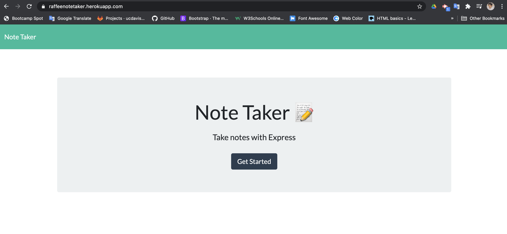
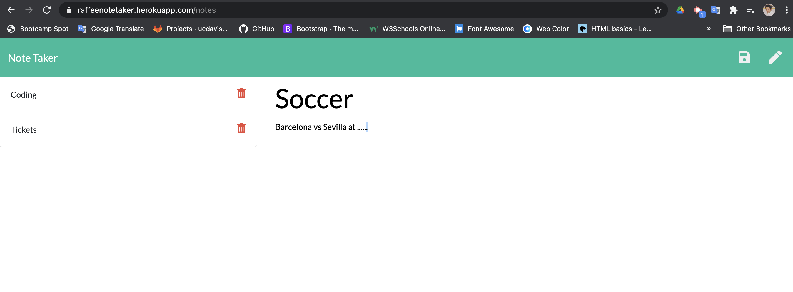

# Note-Taker

## Description
This is an application to write, save, delete notes for your daily activities. 
This application use an express backend to store and retrive note data from a JSON file. 

## User Story

AS A user, I want to be able to write and save notes

* I WANT to be able to delete notes I've written before

* SO THAT I can organize my thoughts and keep track of tasks I need to complete.

## How to use it;
Install all the dependencies by running `npm i` in the terminal and then run `node server.js` in order to run the app. 

## Repos
* [GitHub Profile](https://github.com/raffee1989)
* [GitHub Repo](https://github.com/Raffee1989/Note-Taker)
* [Heroku App](https://raffeenotetaker.herokuapp.com/)
